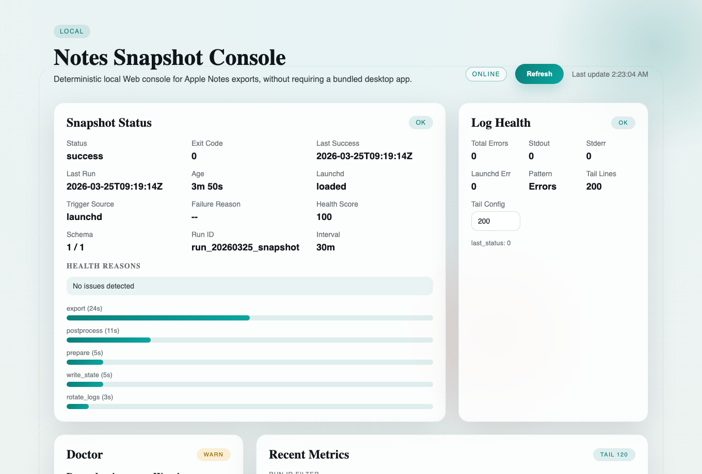
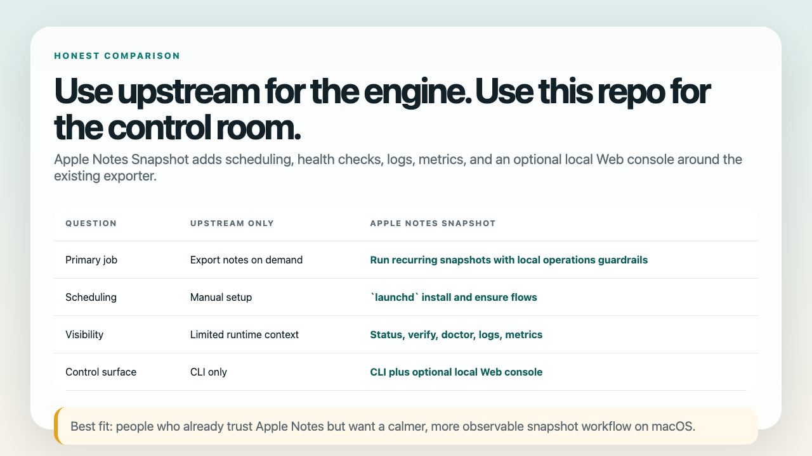
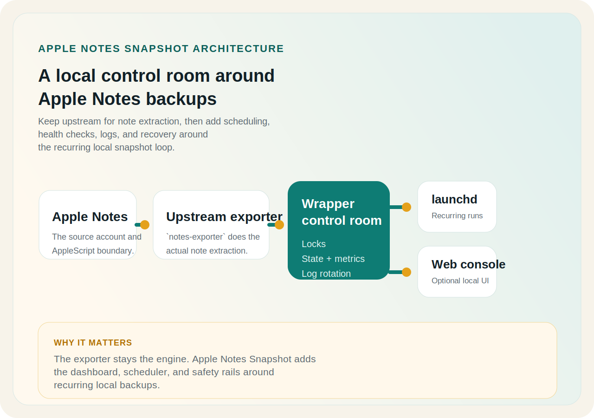
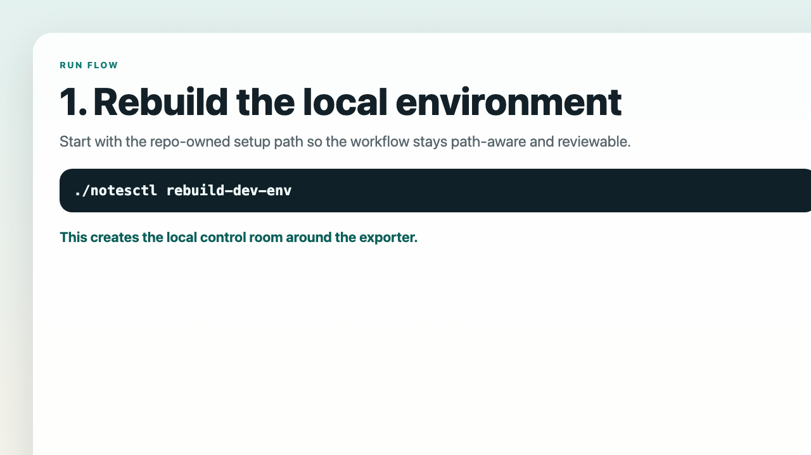

# Apple Notes Snapshot

Apple Notes Snapshot is the local-first backup control room for Apple Notes on
macOS. Keep the upstream `notes-exporter` engine, then add path-aware exports,
`launchd` scheduling, visible health checks, and a calmer recovery path when
the local backup loop drifts.

If you want builder-facing surfaces after the control room already makes sense,
the repo also ships **AI-assisted diagnostics**, a **token-gated Local Web
API**, and a **stdio-first MCP surface** so humans and MCP-aware coding agents
can inspect the same local backup state without turning the workflow into a
hosted service.

[Start the 3-step quickstart](https://xiaojiou176-open.github.io/apple-notes-snapshot/quickstart/) |
[Compare with upstream](https://xiaojiou176-open.github.io/apple-notes-snapshot/compare/) |
[Browse release history](https://xiaojiou176-open.github.io/apple-notes-snapshot/releases/) |
[Open the proof page](https://xiaojiou176-open.github.io/apple-notes-snapshot/proof/) |
[Get support or routing help](https://xiaojiou176-open.github.io/apple-notes-snapshot/support/)

[](https://github.com/xiaojiou176-open/apple-notes-snapshot/actions/workflows/trusted-ci.yml)
[](https://github.com/xiaojiou176-open/apple-notes-snapshot/releases)
[](https://support.apple.com/macos)



- **Keep the path obvious**
  Review or override the export destination before the first snapshot writes.
- **Turn one-off exports into a local loop**
  Use `launchd` to schedule repeatable snapshots instead of babysitting manual exports.
- **See health before you guess**
  Check freshness, failure reasons, logs, and recovery clues when the loop drifts.

> Category: local-first Apple Notes backup control room.
> AI/agent hook: AI-assisted diagnostics plus a token-gated Local Web API and
> a read-only MCP surface for MCP-aware coding agents.
> Result: a calmer, more reviewable backup workflow on your own Mac.

> Best fit: people who already rely on Apple Notes and want a calmer,
> reviewable backup routine on their own Mac.
>
> Not the goal: cloud sync, team collaboration, or two-way write-back into
> Apple Notes.

### What you can prove in one local pass

- **The destination is obvious**: you can review or override the snapshot path before anything writes.
- **The loop is real**: one manual run plus `launchd` turns a one-off export into a repeatable local rhythm.
- **The control room is inspectable**: `status`, `verify`, `doctor`, logs, and proof pages all stay on the same local facts.
- **Builder surfaces are optional**: AI Diagnose, the Local Web API, and MCP all stay behind the operator story instead of replacing it.

If you want the shortest public evidence trail after that first pass, open the
[proof page](https://xiaojiou176-open.github.io/apple-notes-snapshot/proof/).
It collects the repo-owned gates, the GitHub-controlled release and Pages
evidence, and the current same-machine boundary in one place.

Star or follow releases if you want a visible, reviewable local backup control
room instead of another opaque automation snippet.

Builder lane after the first healthy loop:
[AI Diagnose](https://xiaojiou176-open.github.io/apple-notes-snapshot/ai-diagnose/) |
[Local Web API](https://xiaojiou176-open.github.io/apple-notes-snapshot/local-api/) |
[MCP Provider](https://xiaojiou176-open.github.io/apple-notes-snapshot/mcp/) |
[For Codex / Claude Code builders](https://xiaojiou176-open.github.io/apple-notes-snapshot/for-agents/)

## Quickstart

Start here if you want the shortest honest path from manual export to a
repeatable local snapshot loop. The first-successful-run promise is **3 steps
and about 3 minutes**, not a zero-click install.

1. Review `config/notes_snapshot.env` and keep or change the default export path.
2. Run one snapshot so macOS can show Apple Notes / AppleScript permission prompts.
3. Install the scheduler, then verify health.

```bash
# review config/notes_snapshot.env first
./notesctl run --no-status
./notesctl install --minutes 30 --load
./notesctl verify
./notesctl doctor
```

Fail fast:

- If `./notesctl verify` says `FAIL: no last_success record; run ./notesctl run`,
  you have not completed the first manual export yet.
- If macOS permissions block the first run, use `./notesctl permissions` and the
  public [troubleshooting guide](https://xiaojiou176-open.github.io/apple-notes-snapshot/troubleshooting/).
- The full, authoritative guide lives at
  [docs/quickstart](https://xiaojiou176-open.github.io/apple-notes-snapshot/quickstart/).
- The public
  [proof page](https://xiaojiou176-open.github.io/apple-notes-snapshot/proof/)
  shows the repo-side gates, live-surface checks, and trust boundary in one
  place.
- Maintainer-grade verification lives later in
  [Proof and verification](#proof-and-verification); it is not required for the
  first successful snapshot.

## Choose the right lane

Keep the operator lane and the maintainer lane separate.

- **Operator lane**
  - `./notesctl run --no-status`
  - `./notesctl install --minutes 30 --load`
  - `./notesctl verify`
  - `./notesctl doctor`
  - `./notesctl status --full`
  - optional after the local state exists: `./notesctl ai-diagnose`, `./notesctl web`, and `./notesctl mcp`
- **Maintainer lane**
  - `./notesctl clean-cache --dry-run`
  - `./notesctl clean-cache`
  - `./notesctl rebuild-dev-env`
  - `./notesctl update-vendor`
  - `./notesctl setup` / `./notesctl self-heal`

If your goal is a healthy backup loop, stay in the operator lane first. The
maintainer lane is for repo upkeep and contributor verification after the local
workflow already makes sense.

## Why this exists

The upstream [`notes-exporter`](https://github.com/storizzi/notes-exporter)
project is great when you want to export Apple Notes right now. This repository
exists for the moment when "run it once" turns into "keep it healthy every
day."

Apple Notes Snapshot wraps the upstream exporter with:

- one supported human entrypoint: `notesctl`
- scheduled execution via `launchd`
- lock protection to avoid overlapping runs
- structured state and metrics files for health checks
- log rotation and log-health summaries
- an optional local Web console for status and safe actions

## What you get over upstream notes-exporter

Think of upstream as the engine and this repository as the local control room
around it. The wrapper stays local-first, tells you where snapshots will land,
and makes the schedule and health surface easier to inspect when something
breaks.



| Need | Upstream `notes-exporter` | Apple Notes Snapshot |
| --- | --- | --- |
| Export notes once | Yes | Yes |
| Schedule recurring exports | Manual setup | Built-in `launchd` flow |
| Check freshness and last success | Limited | `status`, `verify`, and Web health UI |
| See structured run metadata | Limited | State files, metrics, and summaries |
| Rotate logs and inspect failures | Manual | Wrapper-owned log handling |
| Use a local Web console | No | Optional, token-aware local control plane |

Use upstream directly if you only need a one-time export. Use this repository
when you want a repeatable local backup loop with visible scheduler state,
clear snapshot paths, and easier recovery when something fails.

## What the Web console shows

The local Web console is optional, but it is the fastest way to understand what
the workflow is doing at a glance.

It surfaces:

- snapshot health, last success, launchd state, and failure reason
- doctor warnings and dependency readiness
- recent metrics and trigger sources
- log-health summaries
- access policy and quick actions



## Optional AI and agent-facing surfaces

These are additive surfaces around the same local control room. They do not
replace `notesctl` or the deterministic runtime checks.

- **AI Diagnose**
  Use `./notesctl ai-diagnose` when you want an advisory explanation of the
  current local state. It reads `status`, `doctor`, `log-health`, and recent-run
  summaries, routes model calls through a local Switchyard runtime when AI is
  enabled, and still works as a deterministic fallback when no AI provider is
  configured. Read the public
  [AI Diagnose guide](https://xiaojiou176-open.github.io/apple-notes-snapshot/ai-diagnose/).
- **MCP Provider**
  Use `./notesctl mcp` when you want a stdio-first, read-only-first MCP surface
  for agents. It exposes local backup diagnostics and resources without turning
  the Web console into a fake MCP API. Read the public
  [MCP guide](https://xiaojiou176-open.github.io/apple-notes-snapshot/mcp/).
- **Local Web API**
  Use `./notesctl web` when you want the token-gated local browser control room
  plus a small JSON API backed by the same repo-owned command surface. It is a
  local operator API, not a public OpenAPI or hosted integration surface. Read
  the public
  [Local Web API guide](https://xiaojiou176-open.github.io/apple-notes-snapshot/local-api/).

## How AI and agents fit

Use this mental model if you care about Codex, Claude Code, MCP, or other local
builder ecosystems.

Natural fit:

- Codex- and Claude Code-style local workflows when the host can launch stdio MCP servers
- MCP-aware coding agents that need the same local backup facts as a human operator

- **AI Diagnose = operator next-step assistant**
  - It explains local status, doctor, log-health, and recent-run evidence.
  - It is not a generic chat overlay and it does not become the system truth.
- **MCP Provider = read-only agent substrate**
  - It exposes the same local backup state to MCP-aware hosts.
  - It does not turn the project into a hosted agent platform or write-capable
    remote control plane.
- **Local Web API = token-gated browser/API lane**
  - It serves the local Web console plus JSON endpoints like `status`,
    `doctor`, `recent-runs`, and `access`.
  - It is meant for same-machine browser or local HTTP workflows, not as a
    public OpenAPI promise.
- **`notesctl` + `state.json` + aggregate summaries + token-gated Web API = current local substrate**
  - This repository does not ship a public OpenAPI, generated client, or SDK
    today.
  - The truthful builder entry points are the CLI contract, the token-gated
    local Web API, and the read-only MCP surface.

The builder lane has its own shelves now, so this README does not need to carry
every host-specific setup detail:

- Open the public
  [For Agents guide](https://xiaojiou176-open.github.io/apple-notes-snapshot/for-agents/)
  for the truthful builder overview and proof legend.
- Open the
  [Codex starter pack](https://xiaojiou176-open.github.io/apple-notes-snapshot/for-agents/codex-starter-pack/),
  [Claude Code starter pack](https://xiaojiou176-open.github.io/apple-notes-snapshot/for-agents/claude-code-starter-pack/),
  or
  [OpenClaw starter pack](https://xiaojiou176-open.github.io/apple-notes-snapshot/for-agents/openclaw-starter-pack/)
  when you need host-shaped install guidance.
- Open the
  [Builder integration pack](https://xiaojiou176-open.github.io/apple-notes-snapshot/for-agents/integration-pack/)
  for the capability matrix and copyable examples, or the
  [Public skills pack](https://xiaojiou176-open.github.io/apple-notes-snapshot/for-agents/public-skills/)
  for the curated public-safe instruction subset.
- Open the
  [Local Web API guide](https://xiaojiou176-open.github.io/apple-notes-snapshot/local-api/)
  if your workflow is browser- or local-HTTP-shaped instead of stdio MCP.

## Typical workflows



### 1. Review the export path, then prove the first run

```bash
./notesctl run --no-status
./notesctl install --minutes 30 --load
```

This is the primary getting-started path. Everything else in the docs site is a
supporting surface around that flow.

### 2. Check whether backups are still healthy

```bash
./notesctl status --full
./notesctl verify
./notesctl doctor
```

### 3. Open the local console when you want a control room

```bash
export NOTES_SNAPSHOT_WEB_TOKEN="<long-random-token>"
./notesctl web
```

### 4. Refresh the vendored upstream when you maintain the wrapper

```bash
./notesctl update-vendor --ref <tag|branch|sha>
```

## Who this is for

- People who already rely on Apple Notes and want local, repeatable snapshots
- macOS users who prefer `launchd` over cloud schedulers
- Anyone who wants backup health, logs, and operational visibility around Apple
  Notes exports
- Maintainers who want a reviewable wrapper instead of ad hoc shell snippets

## Who this is not for

- Teams looking for a shared cloud notes product
- Anyone expecting two-way sync back into Apple Notes
- Cross-platform note automation workflows
- Hosted SaaS or desktop app buyers

## Proof and verification

This repository ships with repo-owned verification commands instead of asking
you to trust screenshots alone. These are maintainer / contributor gates, not
required for the first successful snapshot.

If you want the shorter public-facing evidence page first, open the
[proof page](https://xiaojiou176-open.github.io/apple-notes-snapshot/proof/).
It keeps the repo-side gates, GitHub-controlled delivery facts, and live
same-machine boundary in one place. The ladder below remains the
maintainer-grade verification contract.

Default local maintainer lane:

```bash
./notesctl rebuild-dev-env
./.runtime-cache/dev/venv/bin/python -m pre_commit run --all-files
PYTHON_BIN=./.runtime-cache/dev/venv/bin/python scripts/checks/ci_gate.sh
```

Maintainer verification expects a local Python 3.11+ toolchain. `./notesctl rebuild-dev-env`
recreates `.runtime-cache/dev/venv` from scratch so the documented verification
commands stay aligned with the current checkout path and interpreter.
GitHub Actions for this repo run on **GitHub-hosted runners**; the local ladder
below is maintainer verification, not a self-hosted runner requirement.

Five-layer CI contract:

| Layer | Canonical home | What belongs here |
| --- | --- | --- |
| `pre-commit` | local hook | `gitleaks`, docs-link-root hygiene, legacy-path scan, and public-surface-sensitive scan |
| `pre-push` | local hook | `scripts/checks/ci_gate.sh` for repo-local deterministic checks: docs/root hygiene, vendor tree hygiene, unit tests, and wrapper smoke |
| `hosted` | GitHub Actions | `Canonical Quick Gate`, `Secret Scan`, `GitHub Alert Gate`, `Dependency Review`, `Actionlint`, `Zizmor`, `Trivy`, `CodeQL`, and `Pages` |
| `nightly` | GitHub Actions schedule | `Nightly Deterministic Audit` reruns the repo-owned ladder on GitHub-hosted runners without making `pre-push` heavier |
| `manual` | real machine / owner session | `notesctl run|verify|doctor|status`, real browser/session checks, Search Console, named-host attach proof, and other external control-plane evidence |

GitHub-only governance gates:

- `Dependency Review` runs on pull requests because it needs GitHub's base/head
  dependency diff.
- `CodeQL`, `Secret Scan`, `GitHub Alert Gate`, `Actionlint`, `Zizmor`, and
  `Trivy` stay hosted-first; local reruns are optional maintainer repro steps,
  not part of the default hook path.
- Latest release tags should point at the current canonical closeout commit; do
  not treat an older tag as proof of current repo-side closure.

## Runtime and cache contract

Think of the runtime layout as two rooms with one job each:

- repo-local rebuildables live under `.runtime-cache/`
- repo-owned machine-level residue lives under the current machine cache root
  managed by `notesctl`

Current repo-local contract:

- `.runtime-cache/dev/venv` -> repo-owned maintainer virtual environment
- `.runtime-cache/cache/apple-notes-snapshot` -> repo-local runtime cache/state support
- `.runtime-cache/temp` -> scratch
- `.runtime-cache/logs` -> repo-local logs
- `.runtime-cache/pytest` -> pytest cache
- `.runtime-cache/coverage` -> coverage data
- `.runtime-cache/pycache` -> Python bytecode cache
- `.runtime-cache/browser-proof` -> generated proof screenshots that can be rebuilt from the current docs surface
- `.runtime-cache/phase1` -> historical hard-cut rollback artifacts, not current runtime truth
- `.runtime-cache/phase1-history-rebuild` -> historical rebuild rollback artifacts, not current runtime truth
- `.runtime-cache/mcp-registry-lane/out` -> release-ready MCP registry artifacts that can be rebuilt on demand

Current external repo-owned contract:

- launchd records for current and stale labels
- runtime residue for launched repo-owned services
- repo-scoped runtime copies used by the launchd wrapper
- the persistent isolated browser root for this repo
- disposable browser temp residue
- the vendor-runtime current pointer/cache

Older machine-level Application Support and cache roots are migration inputs
only. New repo-owned runtime/cache writes should stay inside the current
repo-managed machine cache root.

## Local cleanup and runtime audit

This is a maintainer-only cleanup lane. It is useful when you are rebuilding
verification tooling or reclaiming repo-owned runtime residue, not when you are
trying to complete the first successful snapshot.

- `./notesctl clean-cache --dry-run`
  - previews repo-local rebuildable/disposable cleanup under `.runtime-cache/`
- `./notesctl clean-cache`
  - removes repo-local rebuildables, generated proof captures, historical rollback bundles, and disposable-generated residue
- `./notesctl runtime-audit`
  - reports repo-local support surfaces plus external repo-owned cache/runtime roots
- `./notesctl clean-runtime --dry-run`
  - previews cleanup for stale non-current residue under the repo-managed machine cache root
- `./notesctl clean-runtime`
  - removes stale external repo-owned residue while protecting current launchd labels
- `./notesctl browser-bootstrap`
  - copies the current `apple-notes-snapshot` source profile out of the default Chrome root into the repo-owned isolated root
- `./notesctl browser-open`
  - launches or attaches to the single repo-owned Chrome instance for this repo
- `./notesctl rebuild-dev-env`
  - restores the canonical path-aware maintainer environment after cleanup

The repo may still clean legacy `.pytest_cache`, `.coverage`, or scattered
`__pycache__` directories if they are already present, but those are migration
backstops. The current contract routes repo-owned disposable artifacts into
`.runtime-cache/*`, including historical rollback folders and proof captures
that are safe to regenerate when you no longer need them.

Automatic janitor hooks run on repo-owned entrypoints that create or reuse
machine-level residue, including `run`, `web`, `install`, `ensure`,
`rebuild-dev-env`, and `runtime-audit`. The default policy is intentionally
strict:

- external repo-owned budget: `2 GB`
- general external TTL: `72 hours`
- browser clone TTL: `24 hours`
- current/protected launchd labels are never deleted by TTL alone
- `browser/chrome-user-data/` is permanent state and excluded from TTL/cap cleanup

This repository does **not** have a repo-owned Docker cleanup lane today.
The automatic janitor does not touch Docker, system temp roots, or shared tool
caches from Cursor, Codex, Claude, Serena, Homebrew, pip, nodeenv, uv, or
other machine-wide tooling.

## Browser automation contract

Browser automation in this repository now uses an **isolated Chrome root +
single repo-owned instance + CDP attach** contract.

- `NOTES_SNAPSHOT_BROWSER_PROVIDER=chrome`
- `NOTES_SNAPSHOT_BROWSER_ROOT=<repo-owned-browser-root>`
- `NOTES_SNAPSHOT_CHROME_USER_DATA_DIR=<repo-owned-browser-root>/chrome-user-data`
- `NOTES_SNAPSHOT_CHROME_PROFILE_NAME=apple-notes-snapshot`
- `NOTES_SNAPSHOT_CHROME_PROFILE_DIR=Profile 1`
- `NOTES_SNAPSHOT_CHROME_CDP_HOST=127.0.0.1`
- `NOTES_SNAPSHOT_CHROME_CDP_PORT=9337`

The old default Chrome user-data root is now only a one-time read source for
`./notesctl browser-bootstrap`. It is no longer the long-term runtime root for
this repo.

Treat `browser-bootstrap` as a one-time migration, not as a routine sync step.
If you later add or refresh logins inside the isolated root, do **not** rerun
`browser-bootstrap` unless you intentionally want to replace the isolated root
from the default Chrome root again.

Use these commands in order:

- `./notesctl browser-bootstrap`
  - one-time copy from the default Chrome root into the isolated repo-owned root
- `./notesctl browser-open`
  - launch the single repo-owned Chrome instance if it is not running yet
  - otherwise return attach info instead of second-launching
- `./notesctl browser-contract --json`
  - print the canonical attach-first contract, including the CDP endpoint for Playwright/CDP clients

If `127.0.0.1:9337` is already occupied on your machine, the repo should fail
fast instead of silently attaching to the wrong thing. In that case, use a
deliberate env override such as `NOTES_SNAPSHOT_CHROME_CDP_PORT=9347` before
starting or attaching to the repo-owned instance.

This repo does **not** silently fall back to bundled Chromium, and it does
**not** keep launching new browser instances against the same user-data dir.
Human manual use and automation are expected to attach to the same repo-owned
Chrome instance.

## CI contract

The repository keeps five verification layers, and they are not interchangeable:

| Layer | Default trigger | Canonical home | Contract |
| --- | --- | --- | --- |
| `pre-commit` | every local commit attempt | local hook | quick hygiene only |
| `pre-push` | every local push attempt | local hook | deterministic repo-local quick gate only |
| `hosted` | pull request / push / workflow dispatch | GitHub-hosted runners | GitHub-state-aware security and policy gates |
| `nightly` | scheduled GitHub run | `Nightly Deterministic Audit` reruns the repo-owned ladder on GitHub-hosted runners |
| `manual` | deliberate human/operator action | real machine / owner session | live browser, desktop, provider, and external control-plane proof |

This open-source repository does **not** rely on a local self-hosted runner
lane. Local verification exists so maintainers can reproduce the repo-owned
gates before or after a pull request, not because CI is expected to run on the
developer's Mac.

High-value local checks:

```bash
./notesctl status --full
./notesctl verify
./notesctl doctor
```

The repo-owned quick gate now covers docs/root hygiene, vendor tree hygiene,
unit tests, and wrapper-level JSON/help smoke checks. GitHub alert state moved
fully into the hosted lane so the default local pre-push path stays lighter and
more deterministic. The 90%+ coverage bar still applies to repo-owned Python
surfaces under `scripts/ops`; the shell wrapper surface is guarded by smoke
checks rather than pretending it shares that coverage metric.

## Verification ladder and test pyramid

Think of the verification contract like a small testing pyramid instead of one
giant "just run everything" blob.

- **Unit tests**
  - fastest checks for repo-owned Python logic and deterministic report shaping
  - examples: `tests/unit/test_ai_diagnose_unit.py`,
    `tests/unit/test_mcp_server_unit.py`,
    `tests/unit/test_web_server_unit.py`
- **Wrapper smoke**
  - repo-owned shell-contract checks for `notesctl` help, JSON surfaces, and
    wrapper entrypoints
  - example: `bash scripts/checks/run_wrapper_smoke.sh`
- **E2E**
  - slower integration checks for launchd, relocation, Web server behavior, and
    real command orchestration
  - example: `./.runtime-cache/dev/venv/bin/pytest tests/e2e --no-cov`
- **Manual-local validation**
  - the real operator path on a real Mac:
    `run -> verify -> status -> doctor -> web`

Read the pyramid as:

1. unit tests catch logic regressions fastest
2. wrapper smoke protects the shell contract
3. E2E checks prove the repo-owned pieces still cooperate
4. manual-local validation proves the actual machine is healthy

## Security and privacy

This project is intentionally local-first:

- your Apple Notes content stays in your own Apple Notes account and export
  destination
- the optional Web console is local by default and token-aware when enabled
- the repository documents private vulnerability reporting in `SECURITY.md`
- secrets, runtime caches, generated launchd files, and logs are not part of
  the tracked source surface

Read [SECURITY.md](SECURITY.md) before reporting sensitive issues.

## FAQ

### Is this a replacement for the upstream exporter?

No. It is a wrapper that makes the upstream exporter safer and easier to operate
as an ongoing local workflow.

### Does it sync changes back into Apple Notes?

No. This repository is for snapshotting and exporting, not two-way sync.

### Do I need the Web console?

No. `notesctl` is the supported human entrypoint. The Web console is optional.

### How do I open the interactive menu?

Run `./notesctl` with no arguments. The interactive menu lives on the canonical
command surface now.

### Do I need GitHub Pages to use the tool?

No. Pages is only for public documentation and search visibility. The actual
workflow stays local on your Mac.

### What if I move the checkout to another path?

Reinstall the scheduler so the path-aware launchd surface points at the current
checkout. If you also use the repo-owned verification environment or the
optional Web console, rebuild that environment too:

```bash
./notesctl install --minutes 30 --load
./notesctl rebuild-dev-env
```

## Community

Use the GitHub Discussions surface that matches your intent:

- Questions and setup blockers:
  [Q&A discussion](https://github.com/xiaojiou176-open/apple-notes-snapshot/discussions/categories/q-a)
- Feature ideas and roadmap input:
  [Ideas discussion](https://github.com/xiaojiou176-open/apple-notes-snapshot/discussions/categories/ideas)
- Real-world usage examples:
  [Show and tell discussion](https://github.com/xiaojiou176-open/apple-notes-snapshot/discussions/categories/show-and-tell)
- Release announcements:
  [Announcements discussion](https://github.com/xiaojiou176-open/apple-notes-snapshot/discussions/categories/announcements)

If you need a support-routing summary first, read [SUPPORT.md](SUPPORT.md) or the
public [support page](https://xiaojiou176-open.github.io/apple-notes-snapshot/support/).

## Contributing

Read [CONTRIBUTING.md](CONTRIBUTING.md) before changing wrapper logic, docs, or
public-facing copy. The project favors small, reviewable changes with explicit
verification notes.

## License

This repository is released under the [MIT License](LICENSE).
